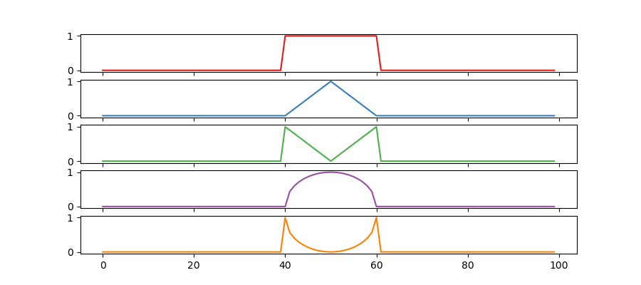

# shapes_1d
A dataset of 1d functions resembling shapes generated from 3 ground truth independent latent factors.

It contains the following 5 shapes

The factors of variation are: width, height, position

### The latent factors of variation
- Shape: : rectangle, triangle, inverted triangle, parabola, inverted parabola
- Width: 20 values in [0.0, 1.0]
- Height: 11 values in [0.0, 1.0]
- Position: 35 values in [0.0, 1.0]
